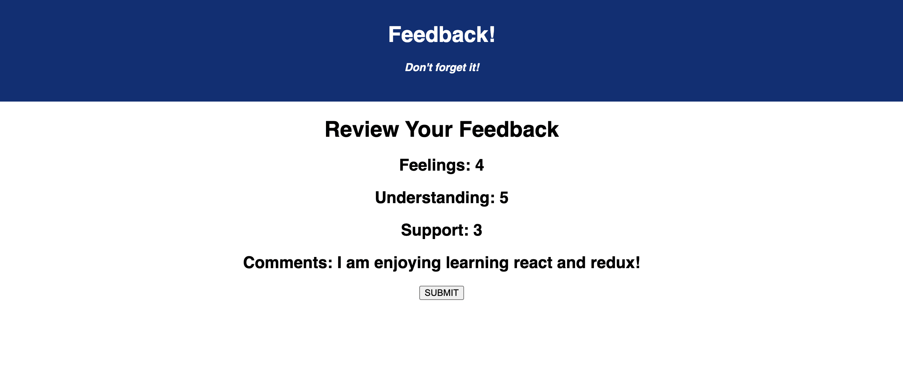

# Redux Feedback Loop

## Description

For this project I built a feedback app. The user answers a list of questions (each located on their own route) and submits their feedback. For the questions I chose to use a dropdown with the values 1-5. When the feedback is submitted it is Posted to a SQL database. Upon completion the user is able to click a button to leave additional feedback which will bring them back to the home page to start the process again. 

Tech used: 

* React
* Redux
* HTML
* CSS
* javaScript
* Node.js
* SQL 

 
 
 
 

## Thank You

I would like to give a special shoutout to dEv Jana and my other instructors at Prime Academy for teaching me the skills and creating the requirements for this project. 